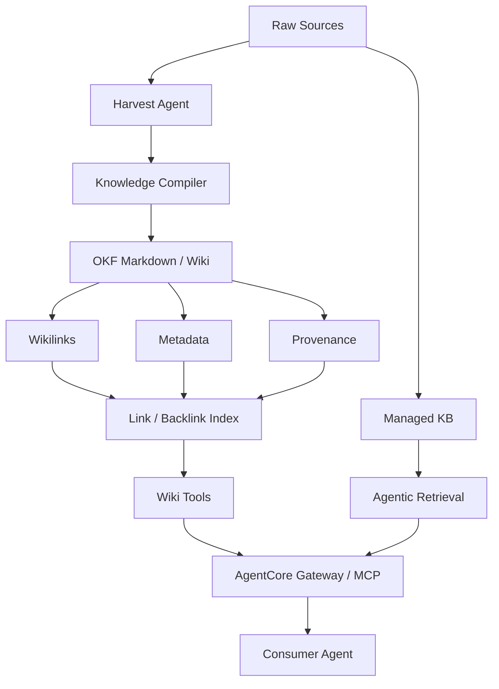
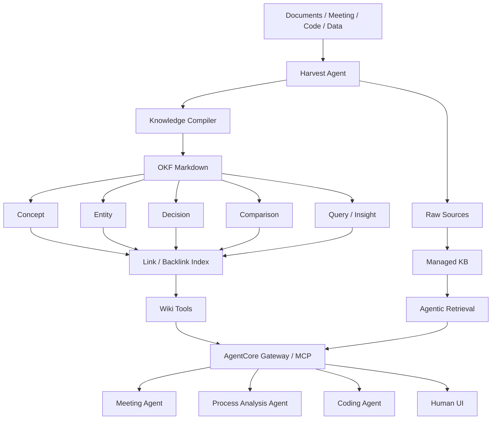

# LLM WikiからAgentic Knowledge Platformへ

## 1. このドキュメントの目的

LLM Wikiを単なる「LLMが読み書きするMarkdown Wiki」として使うのではなく、業務エージェントが継続的に知識を蓄積・整理・検索・共有できる **Agentic Knowledge Platform** へ発展させるための考え方を整理する。

今回の重要なポイントは、LLM WikiをManaged KBやGraphRAGの代替として捉えないことにある。それぞれの役割を分離し、Markdownを中心に疎結合で組み合わせることで、議事録Wikiから始めて、将来的に工程分析Wiki、コードWiki、設計知識Wikiなどへ拡張できる構成を目指す。

> 本資料のLevel 1〜4は業界標準の定義ではなく、LLM Wikiの発展段階を比較しやすくするために本検討で定義した成熟度モデルである。

---

## 2. LLM Wikiの基本的な位置づけ

一般的なRAGは「質問されたときに原文を探す」仕組みである。一方、LLM Wikiは、複数の原文を読み込み、概念・エンティティ・関係・判断結果などをあらかじめ整理し、再利用可能な知識として蓄積する考え方である。

したがって、両者は競合ではなく補完関係にある。

```text
LLM Wiki  = 整理済みのKnowledge
Managed KB = 原文・Evidenceを探すRetrieval
Link / Backlink = 知識同士をたどるNavigation
MCP / API = AgentへKnowledgeを提供するInterface
```

業務用途では、この責務分離が重要になる。

---

## 3. LLM Wiki成熟度モデル

### Level 1: Personal LLM Wiki

最もシンプルなLLM Wiki。Zenn等でよく紹介される構成に近い。

```text
PDF / Web / Notes
        ↓
Claude Code / Codex / Kiro
        ↓
      Skill
        ↓
   Markdown Wiki
        ↓
     Obsidian
```

主な機能:

- Markdownによる知識保存
- Wikilink
- LLMによる要約・ページ生成
- Concept / Entityページ作成
- 個人利用

この段階の主目的は、**「LLMに読ませやすいWikiを作る」こと**である。

---

### Level 2: Managed LLM Wiki

Level 1にWiki運用品質を加えたもの。

主な機能:

- Schema
- YAML Frontmatter
- Link / Backlink
- Lint
- Gitによる履歴管理
- Provenance
- ページ分割・統合ルール
- 複数ソースから既存Conceptを更新

単なる要約集ではなく、「知識として育てる」Wikiになる。

```text
Source A ─┐
          ├─→ Concept X
Source B ─┘       ↑
                  │
Source C ─────────┘
```

新しい資料が追加されるたびに、新規ページを作るだけでなく、既存Conceptの更新、矛盾の追記、関係追加などを行う。

---

### Level 3: Agentic Knowledge Platform

今回目指している中心領域。

Wikiを人が読むためだけのものではなく、複数のAgentが利用するKnowledge Serviceへ発展させる。

主な機能:

- Harvest Agent
- Knowledge Compiler
- OKFライクなMarkdown
- Link / Backlink Index
- Managed KB
- Agentic Retrieval
- MCP / API
- Consumer Agent
- Wiki Lint / Repair
- Gitによる変更履歴



ここでは、Wikiそのものを巨大な検索基盤にするのではなく、**Markdownを中心に周囲の機能を疎結合で組み合わせる**。

---

### Level 4: Enterprise Knowledge Platform

Level 3に組織利用・意味管理・ガバナンスを加えた最終発展形。

主な追加要素:

- Ontology
- Knowledge Graph / GraphRAG
- AgentCore Memory
- 権限管理
- Confidentiality
- Evaluation
- Audit
- Multi-Agent shared knowledge
- Knowledge lifecycle management
- 複数Wiki間の統合

```text
LLM Wiki
   ↓
Agentic Knowledge Platform
   ↓
Ontology / Graph / Memory / Governance
   ↓
Enterprise Knowledge Layer
```

ただし、最初からLevel 4を構築する必要はない。OntologyやGraphRAGは、本当に必要なユースケースが見えた段階で追加する方が現実的である。

---

## 4. 今回の構想はどこに位置するか

今回考えている構成は **Level 3: Agentic Knowledge Platform** に相当する。

一般的なLevel 1のLLM Wikiが、

```text
原文
 ↓
LLM
 ↓
Markdown Wiki
```

であるのに対して、今回の構想は以下になる。

```text
                 Source
                   ↓
             Harvest Agent
                   ↓
             OKF Markdown
                   ↓
        ┌──────────┴──────────┐
        ↓                     ↓
 Link / Backlink          Managed KB
        ↓                     ↓
   Wiki Tools         Agentic Retrieval
        └──────────┬──────────┘
                   ↓
            AgentCore Gateway
                  MCP
                   ↓
           Consumer Agents
```

目的も異なる。

### Level 1

**Wikiを作る。**

### 今回の構想

**Agentが継続的に知識を作り、整理し、検索し、他のAgentへ提供できるKnowledge Platformを作る。**

---

## 5. 最重要の責務分離

### 5.1 LLM Wiki = Knowledge

LLM Wikiには、原文そのものではなく、整理された知識を保持する。

例:

- 現在の課題
- 決定事項
- Concept
- Entity
- 原因仮説
- 比較結果
- 過去からの変化
- 関係する知識へのリンク

---

### 5.2 Managed KB = Evidence

Managed KBには、根拠となる原文を保持する。

例:

- 会議議事録
- PDF
- 設計文書
- 仕様書
- トラブル報告書
- GitHub文書
- Rawデータの説明資料

ユーザーが「その判断の根拠は？」と聞いた場合はWikiではなくManaged KBからEvidenceを取得する。

---

### 5.3 Link / Backlink = Knowledge Navigation

Link / Backlinkは、ConceptやEntity同士の関係を軽量に表現する。

```text
設備A
 ↓
工程B
 ↓
不良C
 ↓
原因仮説D
```

最初から本格的なOntologyやKnowledge Graphを構築しなくても、Markdown Linkを使うことで十分なKnowledge Navigationを実現できる。

この「薄い関係表現」が、Ontologyを重くしすぎないための重要な設計になる。

---

### 5.4 MCP / API = Knowledge Interface

Wikiを特定のUIに閉じ込めない。

```text
                 LLM Wiki
                    │
              MCP / API Layer
                    │
       ┌────────────┼────────────┐
       ↓            ↓            ↓
    Copilot       Claude      業務Agent
```

Wikiの利用者は人だけではなくAgentであるため、UIよりも先にMCP/APIとして利用できる形にしておく価値が高い。

---

## 6. 推奨アーキテクチャ



---

## 7. Harvest Agentの役割

Harvest Agentは単純な「要約Agent」ではない。

新しい資料を取り込んだ際に、以下を判断する。

```text
新しいSource
    ↓
既存Conceptがあるか？
    ├─ YES → Conceptを更新
    └─ NO  → 新規Concept作成

既存情報と矛盾するか？
    ├─ YES → 矛盾・変更履歴を追記
    └─ NO  → 関係を追加

新しいEntityか？
新しいDecisionか？
新しいRelationか？
```

これにより、Wikiは単なる文書倉庫ではなく **Living Knowledge Base** になる。

---

## 8. Wiki QueryとManaged Retrievalの使い分け

### 例1: 現在の状況を知りたい

質問:

> Aプロジェクトの現在の課題は？

検索先:

```text
Wiki Concept
```

整理された最新Knowledgeを回答する。

---

### 例2: 判断根拠を確認したい

質問:

> なぜその判断になった？どの会議で決まった？

検索先:

```text
Managed KB
```

議事録等のEvidenceを取得する。

---

### 例3: 両方必要

質問:

> Aプロジェクトの現在の課題と、その根拠となった会議を教えて。

```text
                Question
                   ↓
              Intent Router
                   ↓
        ┌──────────┴──────────┐
        ↓                     ↓
    Wiki Tools            Managed KB
        ↓                     ↓
   Knowledge              Evidence
        └──────────┬──────────┘
                   ↓
               Final Answer
```

この構造にすることで、KnowledgeとEvidenceを分離しつつ、一つの回答として統合できる。

---

## 9. なぜ最初からGraphRAG/Ontologyを入れないのか

本格的なOntologyは強力だが、初期設計・運用コストが高い。

特に業務知識は変化するため、最初から厳密なクラス・Relationを定義すると、Ontology管理自体がプロジェクトになる可能性がある。

そこで初期段階では、以下の「薄いOntology」から始める。

```text
Markdown Type
+ YAML Metadata
+ Wikilink
+ Backlink
+ Tag
```

必要になったRelationだけを後からGraphへ昇格する。

```text
Markdown Link
     ↓
Relation候補を蓄積
     ↓
頻繁に利用するRelationを特定
     ↓
Ontology / Knowledge Graphへ昇格
```

この方式なら、最初からOntologyをガチで作らずに済む。

---

## 10. 用途別Wikiに分ける

巨大な万能Wikiを1個作るより、用途別にWikiを分けた方が運用しやすい。

例:

```text
Knowledge Platform
 ├─ Meeting Wiki
 ├─ Process Analysis Wiki
 ├─ Coding Wiki
 ├─ Design Wiki
 └─ Incident Wiki
```

各Wikiは共通のMarkdown/Schemaを使いつつ、Concept Typeや検索ルールを用途別に持たせる。

MCP/Gateway側で複数Wikiを統合する。

```text
Meeting Wiki ─────┐
Process Wiki ─────┼─→ MCP / Gateway → Agent
Coding Wiki ──────┘
```

これにより、コンテキスト混入を抑えつつ横断検索できる。

---

## 11. 議事録Wikiから始める場合

最初のPoCとして議事録Wikiは非常に相性が良い。

### Raw

```text
meeting/raw/2026-08-07-project-a.md
```

### Wiki

```text
wiki/
 ├─ concepts/
 │   ├─ project-a-current-issues.md
 │   └─ authentication-design.md
 ├─ entities/
 │   ├─ system-a.md
 │   └─ team-a.md
 ├─ decisions/
 │   └─ decision-2026-08-07-auth.md
 └─ index.md
```

### Harvest

```text
Meeting Transcript
       ↓
Harvest Agent
       ↓
 ┌─────┼────────────┐
 ↓     ↓            ↓
Decision Concept   Action
 ↓     ↓            ↓
Wiki Update / Link Update
```

このPoCで、

- Wiki生成品質
- Concept更新
- Backlink
- Evidence retrieval
- MCP経由の利用

を検証する。

---

## 12. 工程分析Wikiへの展開

議事録Wikiで仕組みを確立した後、工程分析Wikiへ展開できる。

```text
工程
 ↓
設備
 ↓
品質指標
 ↓
異常
 ↓
原因仮説
 ↓
対策
 ↓
結果
```

例:

```text
Process: Welding
Machine: Robot-01
Defect: Spatter
Hypothesis: Current instability
Action: Parameter adjustment
Result: Defect rate improved
```

この段階でも、まずはMarkdown Linkで関係を表現する。

複雑な間接関係探索が必要になった時点でGraphRAGを追加する。

---

## 13. 段階導入ロードマップ

### Phase 1: LLM Wiki MVP

```text
Raw
 ↓
Harvest Agent
 ↓
Markdown Wiki
```

実装:

- Markdown
- YAML Frontmatter
- Concept / Entity / Decision
- Wikilink

---

### Phase 2: Managed Wiki

追加:

- Backlink Index
- Lint
- Repair
- Git履歴
- Provenance

---

### Phase 3: Agentic Knowledge Platform

追加:

- Managed KB
- Agentic Retrieval
- MCP/API
- Intent Router
- Consumer Agent

ここが当面の完成形。

---

### Phase 4: Enterprise Extension

必要になったものだけ追加する。

- AgentCore Memory
- Ontology
- GraphRAG
- Governance
- Evaluation
- Access Control

---

## 14. 設計原則

### Principle 1: Markdownを中心にする

Knowledgeを特定ベンダーのDBに閉じ込めない。

### Principle 2: Rawは不変にする

LLMが原文を直接書き換えない。

### Principle 3: WikiとEvidenceを分離する

WikiはKnowledge、Managed KBはEvidence。

### Principle 4: Ontologyを最初から作り込みすぎない

WikilinkとMetadataから始める。

### Principle 5: UIよりInterfaceを優先する

MCP/APIによりAgentから利用可能にする。

### Principle 6: 巨大Wikiより用途別Wiki

Meeting / Process / Codingなどに分割する。

### Principle 7: Knowledgeを更新する

新規ページ生成だけでなく、既存Conceptを育てる。

---

## 15. 最終イメージ

```text
                         User / Copilot / Agent
                                  │
                                  ↓
                        AgentCore / Router
                                  │
                 ┌────────────────┴────────────────┐
                 ↓                                 ↓
           Knowledge Query                    Evidence Query
                 ↓                                 ↓
            Wiki Tools                         Managed KB
                 ↓                         Agentic Retrieval
                 │                                 │
                 └────────────────┬────────────────┘
                                  ↓
                             MCP / Gateway
                                  ↑
                                  │
                        Knowledge Platform
                                  │
                    ┌─────────────┼─────────────┐
                    ↓             ↓             ↓
               Meeting Wiki   Process Wiki   Coding Wiki
                    ↑             ↑             ↑
                    └─────────────┼─────────────┘
                                  ↑
                             Harvest Agent
                                  ↑
                              Raw Sources
```

---

## 16. 結論

LLM WikiのLevel 1は「LLMに読み書きさせるMarkdown Wiki」である。

今回目指す構成は、その延長ではあるが目的が一段上であり、**Agentが知識を継続的に生成・更新・検索・共有するAgentic Knowledge Platform**を目指している。

重要なのは、高機能なWikiアプリを一つ作ることではない。

```text
Harvest Agent
     +
Portable Markdown / OKF-like Format
     +
Link / Backlink
     +
Managed KB
     +
MCP
```

を疎結合で組み合わせることで、まず議事録Wikiを実現し、その後、工程分析WikiやコードWikiへ横展開する。

Ontology、GraphRAG、MemoryはLevel 4の拡張として必要な場所だけに追加する。

この構成なら、Level 1のLLM Wikiが持つ「Markdownなので簡単」というメリットを残しながら、企業業務で利用できるKnowledge Platformへ段階的に発展させることができる。
