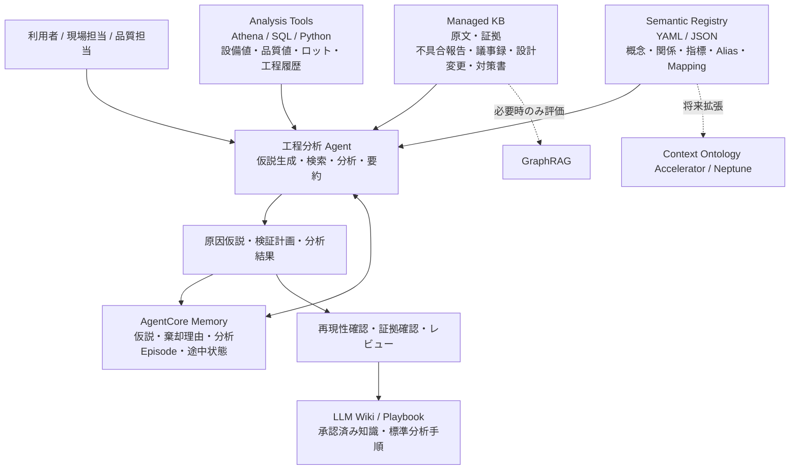
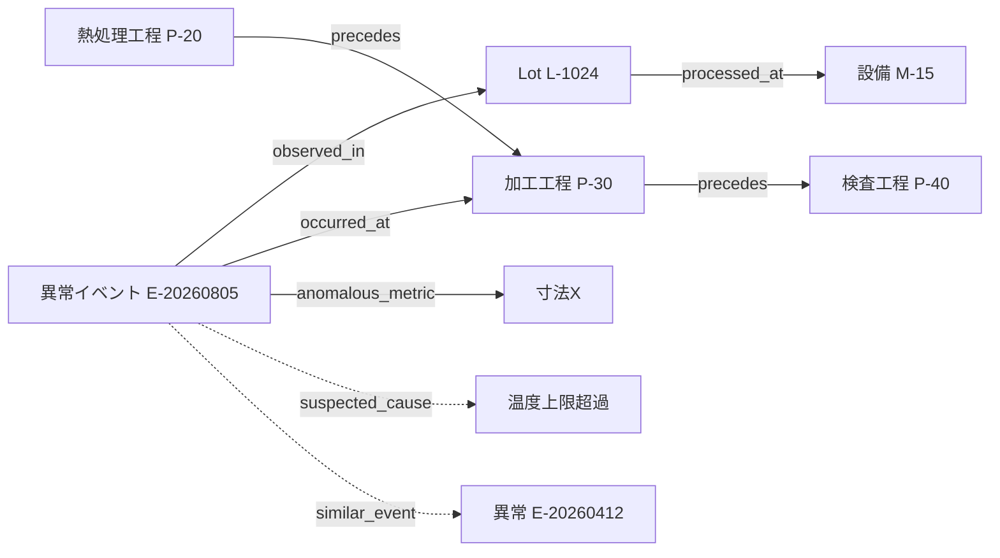

# 薄いオントロジーで作る製造工程分析エージェント

## 1. 目的

本ドキュメントは、製造工程の原因分析・不具合分析を支援するAI Agentを、フルスケールのOntology / Knowledge Graphを最初から構築せずに実現するための設計方針をまとめたものです。

狙いはOntologyそのものを作ることではありません。

> **工程、設備、ロット、工程条件、品質、異常、原因候補を、Agentが毎回同じ意味と構造で扱えるようにすること**

これを最小限のSemantic RegistryとAgentツールで実現し、必要になった段階でContext Ontology Accelerator、Neptune、GraphRAG等へ拡張できる構成を目指します。

---

## 2. 結論

工程分析Agentの初期構成として、次を推奨します。

```text
Managed KB
＋ Analysis Tools（Athena / SQL / Python）
＋ Semantic YAML（薄いOntology）
＋ AgentCore Memory
＋ LLM Wiki / Playbook
```

フルOntologyを最初から構築するのではなく、次の役割分担とします。

| レイヤー | 役割 |
|---|---|
| Managed KB | 不具合報告、議事録、設計変更、対策書などの原文・証拠を検索 |
| Analysis Tools | Athena / SQL / Pythonで設備値、品質値、ロット履歴、工程履歴を分析 |
| Semantic YAML | 用語、概念、関係、指標、Alias、物理データとのマッピングを定義 |
| AgentCore Memory | 試した仮説、除外した原因、有効だった分析手順、途中状態を記憶 |
| LLM Wiki / Playbook | 再現性が確認され、人が承認した知識・標準分析手順を共有 |
| Context Ontology Accelerator | 必要になった段階で正式Ontologyへ拡張する将来候補 |
| GraphRAG | Agentic Retrievalで関係探索の漏れが残る場合のみ評価 |

---

## 3. 基本思想：Ontology Lite

### 3.1 フルOntologyを最初からやらない

フルOntologyは表現力が高い一方で、以下の負荷があります。

- クラス設計
- プロパティ設計
- RDF / OWL
- SHACL
- SPARQL
- Knowledge Graph基盤
- マスターとの同期
- エンティティ名寄せ
- データ品質管理
- 継続的なOntology Governance

工程分析PoCで最初からすべてを導入すると、Agentを作るよりOntology基盤を作ることが目的化しやすくなります。

### 3.2 薄いOntologyで先に得たい効果

最初に狙うのは次の効果です。

1. 用語揺れを抑える
2. Agentが同じ概念を毎回同じ意味で扱う
3. 工程・設備・ロット・品質の関係を明示する
4. 指標の定義を統一する
5. SQL / KB / Memoryを同じEntity IDでつなぐ
6. 原因候補と確定原因を区別する
7. 将来的な正式Ontologyへの移行余地を残す

---

## 4. 推奨アーキテクチャ



### ポイント

- **原文・証拠はManaged KB**
- **数値分析はAthena / SQL / Python**
- **意味の統一はSemantic YAML**
- **分析経験はAgentCore Memory**
- **承認済み知識はLLM Wiki**
- **正式Ontologyは必要になってから**

---

## 5. 最初に定義する8概念

最初から全社Ontologyを作らず、原因分析に直接使う概念だけを定義します。

| Concept | 日本語 | 例 |
|---|---|---|
| Product / Part | 製品・部品 | 製品A、部品B |
| Lot | ロット | Lot-20260807-01 |
| ProcessStep | 工程 | 成形、熱処理、溶接、検査 |
| Equipment | 設備 | 設備M-15、治具、金型 |
| ProcessCondition | 工程条件 | 温度、圧力、速度、レシピ |
| QualityMetric | 品質指標 | 寸法、強度、歩留まり、Cpk |
| AbnormalEvent | 異常イベント | 不良、設備停止、アラーム |
| Countermeasure | 対策 | 条件変更、設備交換、保全 |

必要になってから、Material、Operator、Supplier、Inspection、Maintenance等を追加します。

---

## 6. 最低限定義する関係

```text
ProcessStep ─precedes────────→ ProcessStep
Lot ─processed_at────────────→ Equipment
Lot ─passed_through──────────→ ProcessStep
ProcessStep ─uses_condition──→ ProcessCondition
QualityMetric ─measured_at───→ ProcessStep
AbnormalEvent ─observed_in───→ Lot
AbnormalEvent ─related_to────→ Equipment / ProcessStep
AbnormalEvent ─suspected_cause→ Equipment / ProcessCondition / ProcessStep
AbnormalEvent ─confirmed_cause→ Equipment / ProcessCondition / ProcessStep
AbnormalEvent ─mitigated_by──→ Countermeasure
```

### 原因関係は必ずレベルを分ける

特に重要なのは、相関・仮説・確定原因を同じ関係として扱わないことです。

```text
related_to
= 関連が観測された

suspected_cause
= 原因候補・分析仮説

confirmed_cause
= 検証または人による承認済み原因
```

> **LLMが抽出した関係を、そのまま confirmed_cause に昇格させない。**

---

## 7. Semantic RegistryをYAMLで管理する

初期段階ではOWLを正本にせず、Gitでレビュー可能なYAMLを正本にします。

```yaml
version: "1.0"

entities:
  ProcessStep:
    description: 製造工程の処理単位
    id_fields:
      - process_id

  Equipment:
    description: 工程で使用する設備
    id_fields:
      - equipment_id

  Lot:
    description: 同一条件で製造された製品群
    id_fields:
      - lot_id

  AbnormalEvent:
    description: 不良、設備異常、アラーム
    id_fields:
      - event_id

relations:
  processed_at:
    from: Lot
    to: Equipment

  occurred_at:
    from: AbnormalEvent
    to: ProcessStep

  suspected_cause:
    from: AbnormalEvent
    to:
      - Equipment
      - ProcessCondition
      - ProcessStep
    requires:
      - source_uri
      - confidence

  confirmed_cause:
    from: AbnormalEvent
    to:
      - Equipment
      - ProcessCondition
      - ProcessStep
    requires:
      - source_uri
      - approved_by
      - approved_at

metrics:
  first_pass_yield:
    display_name: 直行率
    formula: good_first_pass / total_input
    grain:
      - date
      - process_id
      - product_id

aliases:
  工程:
    - process
    - process_step
    - operation

  設備:
    - machine
    - equipment
    - facility

sources:
  process_condition:
    physical_source: glue_catalog.production.process_conditions
    timestamp_column: event_time
    entity_key: equipment_id

  inspection_result:
    physical_source: glue_catalog.quality.inspection_results
    timestamp_column: inspected_at
    entity_key: lot_id
```

### YAMLに持たせるもの

- Concept定義
- Relation定義
- IDルール
- Alias / 同義語
- 指標定義
- 単位
- データソースマッピング
- 主要カラムマッピング
- 原因ステータス
- 必須Evidence項目

### YAMLに持たせないもの

- 全センサー値
- 全検査値
- 全ロット履歴
- 全設備イベント
- 全文書

これらの実データは既存のデータ基盤に残します。

---

## 8. 実データはKnowledge Graphに入れない

Ontology / Semantic Registryには「意味」と「参照先」を持たせ、値は既存ストレージから取得します。

```text
Semantic Registry
-----------------
設備とは何か
工程とは何か
直行率とは何か
設備と工程の関係
データの保存先
物理カラムとのMapping

Athena / Iceberg / Time Series DB
---------------------------------
温度
圧力
速度
検査値
ロット履歴
設備アラーム
工程履歴
```

これにより、Knowledge Graphの肥大化と同期コストを避けます。

---

## 9. オンデマンドContext Graph

巨大な全社Knowledge Graphを先に作るのではなく、質問時に必要な範囲だけ一時的なContext Graphとして組み立てます。

### 質問例

> 8月5日の寸法異常について、前後2工程の設備・条件・過去の類似不良を調べて。

### 一時グラフ例



このGraphは以下をAgentが統合して生成します。

- Managed KB：過去不具合、議事録、対策書
- Athena：ロット、設備、工程、品質値
- Semantic Registry：意味、Relation、Mapping
- AgentCore Memory：過去に検証した仮説、棄却原因

### 永続化するもの

- 再現性が確認された関係
- 正式に承認された原因
- 標準分析手順
- Playbook

### 永続化しないもの

- 単発の仮説
- 一時的な相関
- 未検証のLLM推定
- 全ロット・全センサーの一時Graph

---

## 10. Agentに用意する主要ツール

最初からSPARQL中心にせず、工程分析に直接必要なMCP / Pythonツールを用意します。

### resolve_entity

用語、略称、設備名、工程名を正式Entity IDへ変換します。

```text
"15号機"
"M15"
"加工設備15"
      ↓
Equipment: M-15
```

### get_process_lineage

ロットが通過した前後工程を取得します。

### get_equipment_context

対象設備の以下を取得します。

- 金型
- レシピ
- 保全履歴
- アラーム
- 設備条件

### get_metric_definition

Agentが指標の意味を勝手に解釈しないよう、Semantic Registryから正式定義を取得します。

### query_process_data

Athena / SQL / Pythonから工程データを取得・集計します。

### find_related_documents

Equipment ID、Process ID、不良コード等をキーとしてManaged KBを検索します。

### record_hypothesis

原因仮説、根拠、confidence、検証状態を保存します。

### promote_causal_relation

人が承認した仮説だけを正式な原因関係へ昇格させます。

---

## 11. 原因仮説のデータモデル

原因分析結果は自然言語だけで残さず、構造化します。

```json
{
  "hypothesis_id": "HYP-2026-001",
  "event_id": "E-20260805",
  "candidate_cause": {
    "type": "ProcessCondition",
    "id": "TEMP-UPPER-LIMIT"
  },
  "status": "suspected",
  "confidence": 0.72,
  "evidence": [
    {
      "source_type": "athena_query",
      "source_uri": "query://process-condition/123"
    },
    {
      "source_type": "managed_kb",
      "source_uri": "s3://quality/reports/report-20260412.pdf"
    }
  ],
  "next_validation": "同一設備の正常ロットと温度分布を比較する"
}
```

推奨statusは以下です。

```text
suspected  : 原因候補
validated  : 分析上の再現性を確認
confirmed  : 人または正式プロセスで承認済み
rejected   : 仮説を棄却
```

---

## 12. AgentCore Memoryの役割

AgentCore MemoryはOntologyの正本ではなく、**分析経験の記憶層**として利用します。

### 保存する

- 試した仮説
- 棄却した仮説と理由
- 有効だった分析方法
- 使用したSQLや分析条件
- 分析途中の状態
- 類似案件
- 人から受けたフィードバック
- 次に確認する項目

### 保存しない

- 設備マスターの正本
- 工程ルートの正式マスター
- 品質指標の正式定義
- 確定済み業務ルール

### Namespace例

```text
/plant/{plant_id}/process/{process_id}/episodes
/plant/{plant_id}/equipment/{equipment_id}/lessons
/project/{project_id}/hypotheses
/user/{user_id}/preferences
```

---

## 13. LLM Wiki / Playbookとの役割分担

AgentCore MemoryとLLM Wikiは一部重複するため、境界を明示します。

### AgentCore Memory

```text
今回の分析で温度が怪しかった
設備摩耗の仮説は棄却した
次は材料ロットを調べる
同種案件ではこのSQLが有効だった
```

→ **経験・途中状態・分析Episode**

### LLM Wiki / Playbook

```text
設備M-15で寸法異常が発生した場合の標準分析手順
温度異常と寸法変動の既知パターン
正式に承認された恒久対策
設備停止時の標準切り分けPlaybook
```

→ **再現性があり、人が承認した共有知識**

### Knowledge Promotion

```text
分析経験
  ↓
AgentCore Memory
  ↓
複数案件で再現
  ↓
Managed KBで証拠確認
  ↓
Reviewer Agent / 人がレビュー
  ↓
LLM Wiki / Playbookへ昇格
```

---

## 14. Managed KBの役割

Managed KBは「原因を確定する場所」ではなく、**原文・証拠を取得する場所**です。

対象例：

- 不具合報告書
- 過去トラブル報告
- 議事録
- 設計変更書
- 品質基準
- 作業標準
- 設備マニュアル
- 恒久対策書
- 保全報告

Agentic Retrievalで複雑な質問を分解し、複数文書を横断してEvidenceを収集します。

---

## 15. GraphRAGの位置付け

GraphRAGは初期必須機能としません。

```text
Managed KB + Agentic Retrieval
        ↓
まず検索品質を評価
        ↓
間接関係の取りこぼしが多いか？
        ├─ No  → GraphRAG不要
        └─ Yes → 対象領域だけA/B評価
```

GraphRAGを検討する条件：

- 多数の文書に同じ設備・部品・不具合が散在する
- 2〜3ホップ先の関連文書を発見したい
- Vector Searchでは意味的に遠い文書を拾えない
- 「関連する事象を広く列挙」が重要

ただし、GraphRAGの自動抽出された関係を正式な因果関係とは扱いません。

---

## 16. Context Ontology Acceleratorへの拡張条件

次の問題が顕在化するまではOntology Liteで進めます。

- 工場・部門ごとに用語定義が衝突する
- 複数データソース間の意味統合が難しくなる
- 複数Agentが同じ意味体系を利用する
- SPARQLによる横断問い合わせが必要になる
- SHACL等による整合性検証が必要になる
- 業務ルール・制約が複雑になる
- 品質・法規判定で厳密なGovernanceが必要になる

その段階でSemantic YAMLを起点に正式Ontologyへ拡張します。

---

## 17. 段階的な実装ロードマップ

### Phase 1：Ontologyをほぼ使わない

```text
Managed KB
＋ Athena / Python
＋ AgentCore Memory
＋ YAML用語辞書
```

実装範囲：

- 8 Concept
- 8〜12 Relation
- Alias辞書
- 主要指標5〜10個
- データソースMapping
- 原因仮説JSON Schema

### Phase 2：Semantic Registry化

追加：

- YAML Schema / Pydantic Validation
- Entity Resolver
- get_process_lineage
- get_metric_definition
- query_process_data
- 共通Entity ID

### Phase 3：オンデマンドContext Graph

追加：

- 質問時に対象ロット・工程・設備だけGraph化
- 前後工程探索
- 類似異常リンク
- 原因候補リンク
- 一時GraphによるAgent Reasoning支援

### Phase 4：Knowledge Promotion

追加：

- Memoryから知識候補抽出
- 再現性確認
- Evidence確認
- Reviewer Agent
- 人による承認
- LLM Wiki / Playbook化

### Phase 5：必要なら正式Ontology

必要に応じて：

- Context Ontology Accelerator
- Neptune
- RDF / OWL
- SPARQL
- SHACL
- GraphRAG

を段階的に評価します。

---

## 18. やること / やらないこと

### やること

- 原因分析に必要なConceptだけ定義
- Entity IDを統一
- Aliasを管理
- 指標の定義を明示
- 原因関係をrelated / suspected / confirmedに分ける
- Evidence URIを必ず残す
- 仮説を構造化して保存
- Memoryで分析経験を学習
- Wikiへは承認済み知識だけ昇格
- 実データは既存データ基盤からオンデマンド取得

### やらないこと

- 全社Ontologyを先に設計
- 全テーブル・全カラムの意味モデル化
- 全センサー値をKnowledge Graphへ保存
- 全ロット履歴をGraphへ永続化
- LLM推定の因果関係を自動確定
- OWL / SHACL / SPARQLを初日から同時導入
- GraphRAGと正式Ontologyを同時導入
- Entity ResolutionをLLMだけに任せる

---

## 19. 成功指標

PoCではOntologyの完成度ではなく、工程分析の実務価値を評価します。

### Retrieval

- 関連文書Recall
- Evidence取得率
- 正しい設備・工程・ロットへのEntity Resolution率

### Analysis

- 原因候補Top-K Recall
- 原因調査に必要なデータ取得回数
- 不要な分析の削減率
- 正常群・異常群比較までのリードタイム

### Agent

- 同一質問への回答一貫性
- 過去仮説の再利用率
- 棄却済み仮説の再提案率
- 人が修正した回数

### Knowledge

- Memory → Wikiへの昇格率
- Wiki知識の再利用率
- 古いPlaybookの検出率
- Evidenceなしの知識登録件数

### Business

- 原因分析時間
- 熟練者への問い合わせ回数
- 原因特定までの日数
- 恒久対策までのリードタイム
- 再発率

---

## 20. 最終推奨構成

```text
                    工程分析Agent
                         │
          ┌──────────────┼──────────────┐
          ▼              ▼              ▼
     Managed KB     Analysis Tools   Semantic YAML
     原文・証拠      Athena/Python    薄い意味モデル
          │              │              │
          └──────────────┼──────────────┘
                         ▼
                 原因仮説・検証計画
                         │
             ┌───────────┴───────────┐
             ▼                       ▼
      AgentCore Memory          LLM Wiki
      分析経験・途中状態         承認済み共有知識
```

### 一言で言うと

> **全データをグラフ化するのではなく、「意味だけ薄く定義し、必要なデータと関係を質問時に組み立てる」。**

これにより、Ontologyの設計・運用負荷を抑えながら、Agentが工程・設備・ロット・品質・異常を一貫した意味で扱えるようにします。

まずはこのOntology Liteで工程分析Agentの価値を検証し、正式Ontologyが必要になった段階で拡張する方針とします。

---

## 21. 参考

- Amazon Bedrock Knowledge Bases
  - https://docs.aws.amazon.com/bedrock/latest/userguide/knowledge-base.html
- Amazon Bedrock AgentCore Memory
  - https://docs.aws.amazon.com/bedrock-agentcore/latest/devguide/memory.html
- AWS Context Ontology Accelerator
  - https://github.com/aws/context-ontology-accelerator
- AWS sample: Kiro LLM Wiki
  - https://github.com/aws-samples/sample-kiro-llm-wiki

---

## 22. 次に実装するもの

PoCを開始する場合は、次の順番を推奨します。

1. `semantic.yaml` の初版作成
2. Pydantic / JSON SchemaによるValidation
3. Entity Resolver実装
4. Athenaデータ取得Tool実装
5. Managed KB検索Tool実装
6. 原因仮説Schema実装
7. AgentCore Memory Strategy設計
8. 原因分析AgentのOrchestration実装
9. 評価用の既知不具合ケースを10〜30件作成
10. Agentic Retrieval / Semantic Layer / MemoryのA-B評価

この10項目を最小PoCのDefinition of Doneとします。
